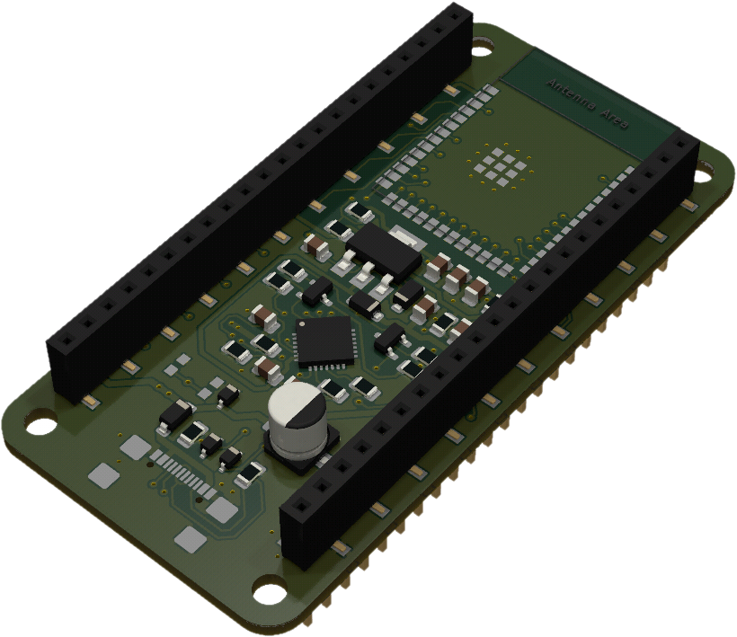

# Mainboard

The mainboard is the central module, featuring an ESP32 and a USB interface. It supports multiple wireless protocols and offers two sets of GPIO outputs on both the top and bottom sides of the board. This design allows for highly versatile expansion using additional extension modules. The mainboard can also be used on a standard breadboard with external electronic components and wiring.

## Specifications

- [ESP32-S3-WROOM-1-N8](https://www.espressif.com/sites/default/files/documentation/esp32-s3-wroom-1_wroom-1u_datasheet_en.pdf) (8 MB Flash)
- USB-C with CP2102N USB to UART bridge
- 44 GPIO pins compatible with [DevKitC-1 pin layout](https://docs.espressif.com/projects/esp-dev-kits/en/latest/esp32s3/esp32-s3-devkitc-1/user_guide.html#pin-layout)

## Pinout

!!! info
    Work in progress

## 3D Board Preview

<figure markdown="span">
    { width=300 }
</figure>
