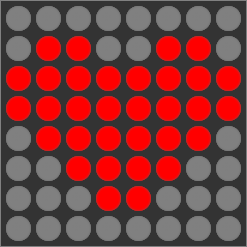
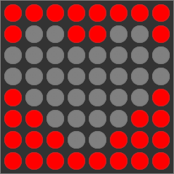

# Shapes

{ align=right width=150 }

Draw a custom shape, such as circle, square, or a more complicated sprite. Do this by creating a two-dimensional array of bytes with a simple logic of `1` for light on and `0` for light off.

## Challenges

??? tip "Challenge 1"

    Invert your shape **without modifying the array itself**. Pixels which are now on should be off and vice-versa.

    { width=150 }

??? tip "Challenge 2"

    Define your shape in base16 (Hexadecimal) instead of base2 (Binary).
    For example:

    ```
    0  0  0  0  0  0  0  0
	0  1  1  0  0  1  1  0
	1  1  1  1  1  1  1  1
	1  1  1  1  1  1  1  1
	0  1  1  1  1  1  1  0
	0  0  1  1  1  1  0  0
	0  0  0  1  1  0  0  0
	0  0  0  0  0  0  0  0   <-- base2

    30 78 7C 7E 7E 7C 78 30  <-- Base16
    ```

## Example

```arduino
#include <MD_MAX72xx.h>

#define HARDWARE_TYPE MD_MAX72XX::FC16_HW
#define CS_PIN 10
#define SEGMENTS 1

MD_MAX72XX display = MD_MAX72XX(HARDWARE_TYPE, CS_PIN, SEGMENTS);

const int frame[8][8] = {
	{0, 0, 0, 0, 0, 0, 0, 0},
	{0, 1, 1, 0, 0, 1, 1, 0},
	{1, 1, 1, 1, 1, 1, 1, 1},
	{1, 1, 1, 1, 1, 1, 1, 1},
	{0, 1, 1, 1, 1, 1, 1, 0},
	{0, 0, 1, 1, 1, 1, 0, 0},
	{0, 0, 0, 1, 1, 0, 0, 0},
	{0, 0, 0, 0, 0, 0, 0, 0}
};

void displayShape(const int frame[8][8]) {
	for (int row = 0; row < 8; row++) {
		for (int col = 0; col < 8; col++) {
			display.setPoint(col, row, frame[row][col]);
		}
	}
}

void setup() {
	display.begin();
	display.clear();
	displayShape(frame);
}

void loop() {
}
```
